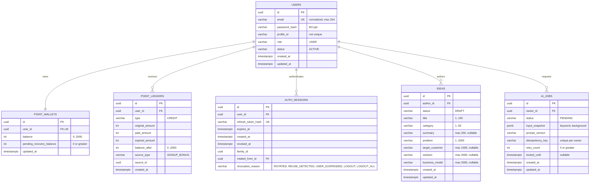

# SeedRank ERD

현재 구현된 데이터 모델을 수직 슬라이스 단위로 갱신한다.

## VS-001 제약

- `users.email`만 유일하며 공개 프로필 아이디는 중복을 허용한다.
- 사용자당 Point 지갑은 하나만 생성한다.
- 가입 시 User, PointWallet, PointLedger를 같은 트랜잭션에 저장한다.
- 가입 원장은 `300 = paidAmount(300) + expiredAmount(0)`을 만족한다.
- PointLedger는 append-only 데이터로 취급한다.
- 로그인 Refresh Token은 원문이 아닌 SHA-256 해시로만 AuthSession에 저장한다.
- Refresh Token은 family ID와 이전 세션 ID로 회전 계보를 보존하며 재사용 탐지 시 패밀리를 폐기한다.
- Access Token의 `sid` 클레임은 `auth_sessions.id`를 가리키며, 서명·만료와 해당 세션 활성 상태를 함께 검증한다.
- 현재 로그아웃은 세션 family를 `LOGOUT`으로, 전체 로그아웃은 사용자의 모든 활성 세션을 `LOGOUT_ALL`로 폐기한다.
- 로그인·갱신·로그아웃의 세션 변경은 사용자 행 잠금 후 수행해 동시 요청을 직렬화한다.

## VS-009 제약

- 로그인 사용자는 AI 없이 Idea를 `DRAFT` 상태로 생성한다.
- Draft 작성자는 내부 User UUID로 연결하며, 작성자만 Draft 상세를 조회한다.
- 제목·카테고리·문제는 필수이고 나머지 내용은 미완성 Draft를 위해 nullable이다.
- 게시 상태, 공개 범위, 최초 버전, 가격·보상과 AI Job 연결은 후속 슬라이스에서 추가한다.

## VS-018 제약

- 로그인 사용자의 사업화 키워드와 문제의식, 서버 Prompt Version을 생성 시점의 JSON 스냅샷으로 저장한다.
- Job은 `PENDING`, retry count 0으로 생성하며 Worker 선점과 상태 전이는 후속 슬라이스에서 구현한다.
- `(owner_id, idempotency_key)` 고유 제약으로 순차·동시 재전송을 한 Job으로 수렴시킨다.
- 같은 사용자의 같은 Key·같은 입력은 기존 Job을 반환하고, 다른 입력에 Key를 재사용하면 거부한다.
