# SeedRank ERD

현재 구현된 데이터 모델을 수직 슬라이스 단위로 갱신한다.

```mermaid
erDiagram
    USERS ||--|| POINT_WALLETS : owns
    USERS ||--o{ POINT_LEDGERS : receives
    USERS ||--o{ AUTH_SESSIONS : authenticates
    USERS ||--o| COMPANY_PROFILES : registers
    COMPANY_PROFILES ||--o{ COMPANY_VERIFICATIONS : verifies
    USERS ||--o{ IDEAS : authors
    USERS ||--o{ FEEDBACKS : writes
    IDEAS ||--o{ VALIDATION_QUESTIONS : validates
    IDEAS ||--o{ IDEA_VERSIONS : snapshots
    IDEAS ||--o{ IDEA_TIMELINE_EVENTS : records
    IDEAS ||--o{ FEEDBACKS : receives

    USERS {
        uuid id PK
        varchar email UK "normalized, max 254"
        varchar password_hash "BCrypt"
        varchar profile_id "not unique"
        varchar role "USER | COMPANY"
        varchar status "ACTIVE"
        timestamptz created_at
        timestamptz updated_at
    }

    POINT_WALLETS {
        uuid id PK
        uuid user_id FK,UK
        int balance "0..2000"
        int pending_recovery_balance "0 or greater"
        timestamptz updated_at
    }

    POINT_LEDGERS {
        uuid id PK
        uuid user_id FK
        varchar type "CREDIT"
        int original_amount
        int paid_amount
        int expired_amount
        int balance_after "0..2000"
        varchar source_type "SIGNUP_BONUS, DAILY_FIRST_ACCESS, IDEA_PUBLISHED, FEEDBACK_CREATED, FEEDBACK_ACCEPTED"
        uuid source_id
        date policy_date "nullable for signup, Asia/Seoul"
        timestamptz created_at
    }

    AUTH_SESSIONS {
        uuid id PK
        uuid user_id FK
        varchar refresh_token_hash UK
        timestamptz expires_at
        timestamptz created_at
        timestamptz revoked_at
        uuid family_id
        uuid rotated_from_id FK
        varchar revocation_reason "ROTATED, REUSE_DETECTED, USER_SUSPENDED, LOGOUT, LOGOUT_ALL"
    }

    COMPANY_PROFILES {
        uuid id PK
        uuid user_id FK,UK
        varchar company_name "trimmed, max 100"
        varchar company_email UK "normalized, response/log excluded"
        varchar company_domain "lowercase ASCII"
        timestamptz verified_at "company verification completion time"
        timestamptz created_at
        timestamptz updated_at
    }

    COMPANY_VERIFICATIONS {
        uuid id PK
        uuid company_profile_id FK
        varchar token_hash UK "SHA-256 lower hex, raw token excluded"
        timestamptz expires_at
        timestamptz used_at "single-use completion time"
        timestamptz invalidated_at "set by resend"
        timestamptz created_at
    }

    IDEAS {
        uuid id PK
        uuid author_id FK
        varchar status "DRAFT | PUBLISHED | ARCHIVED"
        varchar title "1..100"
        varchar category "1..50"
        varchar summary "max 200, nullable"
        varchar problem "1..2000"
        varchar target_customer "max 1000, nullable"
        varchar solution "max 2000, nullable"
        varchar business_model "max 2000, nullable"
        varchar visibility "PUBLIC | SEMI_PUBLIC | MATCHING, nullable for Draft"
        int current_unit_price "10P at publication, nullable for Draft"
        timestamptz published_at "nullable for Draft"
        timestamptz created_at
        timestamptz updated_at
    }

    VALIDATION_QUESTIONS {
        uuid id PK
        uuid idea_id FK
        text question "not blank"
        int sort_order "1..3, unique per idea"
    }

    IDEA_VERSIONS {
        uuid id PK
        uuid idea_id FK
        int version_number "unique per idea"
        varchar title
        varchar category
        varchar summary
        varchar problem
        varchar target_customer
        varchar solution
        varchar business_model
        varchar visibility
        text validation_questions "ordered immutable snapshot"
        uuid editor_id FK
        timestamptz created_at
    }

    IDEA_TIMELINE_EVENTS {
        uuid id PK
        uuid idea_id FK
        varchar event_type "PUBLISHED"
        uuid actor_id FK
        timestamptz created_at
    }

    FEEDBACKS {
        uuid id PK
        uuid idea_id FK
        uuid user_id FK
        varchar feedback_type "PROBLEM_EMPATHY | TARGET_CUSTOMER | SOLUTION | BUSINESS_MODEL | COMPETITION | OTHER"
        varchar content "normalized, 100..2000"
        varchar evidence_url "optional http/https"
        varchar evidence_description "optional, max 1000"
        timestamptz accepted_at "nullable until VS-027"
        timestamptz edited_at "nullable until VS-026"
        timestamptz deleted_at "nullable until VS-026"
        timestamptz created_at
    }
```

## VS-001 제약

- `users.email`만 유일하며 공개 프로필 아이디는 중복을 허용한다.
- 사용자당 Point 지갑은 하나만 생성한다.
- 가입 시 User, PointWallet, PointLedger를 같은 트랜잭션에 저장한다.
- 가입 원장은 `300 = paidAmount(300) + expiredAmount(0)`을 만족한다.
- PointLedger는 append-only 데이터로 취급한다.
- `point_ledgers`의 UPDATE·DELETE는 데이터베이스 trigger가 거부하며 정정이 필요하면 새 원장 행을 추가한다.

## VS-031 제약

- 가입 보너스를 제외한 활동 보상은 Asia/Seoul 정책 날짜별 실제 지급 합계가 300P를 넘지 않는다.
- 지갑 잔액은 2,000P를 넘지 않으며 일일 한도나 지갑 상한 초과분은 원장에 `expired_amount`로 남기고 회수 대기 잔액으로 전환하지 않는다.
- 활동 보상은 `source_type`, `source_id` 조합당 한 번만 처리하며 사용자 지갑 행 잠금으로 같은 사용자의 동시 보상을 직렬화한다.
- 가입 보너스의 `policy_date`는 null이고 활동 보상은 Asia/Seoul 기준 날짜를 반드시 기록한다.

## VS-056 제약

- 활성 사용자의 성공한 로그인은 Asia/Seoul 정책 날짜별 첫 접속 1회에만 30P를 지급한다.
- 사용자 UUID와 정책 날짜로 만든 결정적 출처 UUID 및 `(source_type, source_id)` 유일 제약으로 연속·동시 로그인을 멱등 처리한다.
- 일일 첫 접속 보상은 하루 300P 활동 한도와 지갑 2,000P 상한을 적용하며 초과분을 원장에 소멸로 기록한다.
- 로그인 세션 생성과 첫 접속 Point 지급은 같은 트랜잭션에서 완료되거나 함께 롤백된다.
- 로그인 Refresh Token은 원문이 아닌 SHA-256 해시로만 AuthSession에 저장한다.
- Refresh Token은 family ID와 이전 세션 ID로 회전 계보를 보존하며 재사용 탐지 시 패밀리를 폐기한다.
- Access Token의 `sid` 클레임은 `auth_sessions.id`를 가리키며, 서명·만료와 해당 세션 활성 상태를 함께 검증한다.
- 현재 로그아웃은 세션 family를 `LOGOUT`으로, 전체 로그아웃은 사용자의 모든 활성 세션을 `LOGOUT_ALL`로 폐기한다.
- 로그인·갱신·로그아웃의 세션 변경은 사용자 행 잠금 후 수행해 동시 요청을 직렬화한다.

## VS-006 제약

- 사용자당 회사 프로필은 하나이며 정규화된 회사 이메일도 중복될 수 없다.
- 사용자 삭제 시 종속 회사 프로필도 함께 삭제된다.
- 회사 이메일 도메인은 소문자 ASCII로 정규화하고 무료 개인 메일 도메인 및 그 하위 도메인을 거부한다.
- 회사 이메일은 API 응답과 일반 로그에 노출하지 않는다.
- `verified_at`은 회사 인증 완료 전까지 null이며, 완료 시 인증 토큰의 `used_at`과 같은 시각으로 기록된다. 프로필이 존재하고 미인증이면 내 계정 상태는 `PENDING`, 인증 완료면 `VERIFIED`다.
- 인증 토큰과 메일 발송 데이터는 VS-007, 인증 완료와 Company 역할은 VS-008에서 추가한다.

## VS-007 제약

- 회사 인증 토큰은 URL-safe 256-bit 난수이며 원문은 메일 링크에만 전달하고 DB에는 SHA-256 해시만 저장한다.
- 인증은 기본 30분 뒤 만료되며 만료 시간은 애플리케이션 설정으로 변경할 수 있다.
- 회사 프로필별 미사용·미무효화 인증은 하나만 존재하며 재발송 시 기존 인증을 무효화한다.
- 메일은 요청 트랜잭션이 커밋된 뒤 별도 Executor에서 SMTP Provider로 발송한다.
- 회사 프로필 삭제 시 종속 인증 레코드도 함께 삭제된다.
- 유효한 인증 토큰은 행 잠금 뒤 한 번만 소비하며 `used_at`, `company_profiles.verified_at`, `users.role=COMPANY`를 한 트랜잭션에서 변경한다.

## VS-009 제약

- 로그인 사용자는 AI 없이 Idea를 `DRAFT` 상태로 생성한다.
- Draft 작성자는 내부 User UUID로 연결하며, 작성자만 Draft 상세를 조회한다.
- 제목·카테고리·문제는 필수이고 나머지 내용은 미완성 Draft를 위해 nullable이다.
- 게시 상태, 공개 범위, 최초 버전, 가격·보상과 AI Job 연결은 후속 슬라이스에서 추가한다.

## VS-013 제약

- 아이디어 작성자는 검증 질문 1~3개를 전체 교체 방식으로 저장한다.
- 요청 배열 순서를 아이디어별 고유한 `sort_order` 1~3으로 보존한다.
- 질문 문구는 앞뒤 공백을 제거하고 빈 값은 허용하지 않는다.
- 아이디어 삭제 시 해당 검증 질문도 함께 삭제한다.

## VS-010 제약

- 완성된 Draft와 검증 질문 1~3개만 `PUBLIC`, `SEMI_PUBLIC`, `MATCHING` 중 하나로 게시할 수 있다.
- 게시 전환, 최초 전체 스냅샷 버전, 10P 현재 Unit 가격, 게시 타임라인과 해당 Point 보상은 하나의 트랜잭션이다.
- 아이디어 행을 잠가 중복·동시 게시에서도 최초 버전·타임라인·보상 출처가 한 번만 생성되게 한다.
- 공개형·반공개형 게시 보상은 50P이며 Asia/Seoul 하루 두 번까지 지급한다. 이후 게시 시도는 게시를 허용하되 전액 소멸 원장을 남긴다.
- 매칭형 게시에는 게시 보상을 지급하거나 원장을 생성하지 않는다.

## VS-011 조회 제약

- 공개형은 Guest를 포함한 모든 조회자에게 아이디어 전체 내용과 검증 질문을 반환한다.
- 반공개형 Guest에는 제목·카테고리·요약·문제 정의와 공통 게시 정보만 반환하며, 로그인 User·Company·작성자는 전체 내용을 조회한다.
- 매칭형은 Guest·User·Company에 요약과 공통 게시 정보만 반환하고 작성자에게만 전체 내용을 반환한다.
- 공개 범위상 숨겨진 필드는 `null` 값으로 직렬화하지 않고 JSON 응답 키 자체를 제외한다.
- Draft와 향후 비게시 상태는 작성자에게만 반환하며 다른 조회자에게는 존재 여부를 숨긴다.

## VS-024 제약

- 활성 로그인 사용자는 `PUBLIC`, `SEMI_PUBLIC`, `MATCHING`으로 게시된 아이디어에 구조화 피드백을 등록할 수 있다.
- 피드백 유형과 앞뒤 공백 제거 후 100~2,000자 의견은 필수이며 HTTP(S) 근거 URL과 1,000자 이하 근거 설명은 선택이다.
- Feedback 생성과 `FEEDBACK_CREATED` 20P 활동 보상 원장을 하나의 트랜잭션으로 처리한다.
- Asia/Seoul 정책 날짜의 여섯 번째 피드백부터는 Feedback은 저장하되 일일 5회 제한으로 보상 전액을 소멸 기록한다.
- 목록·수정·삭제·이력·채택은 VS-025~027에서 확장한다.
