# SeedRank ERD

현재 구현된 데이터 모델을 수직 슬라이스 단위로 갱신한다.

```mermaid
erDiagram
    USERS ||--|| POINT_WALLETS : owns
    USERS ||--o{ POINT_LEDGERS : receives
    USERS ||--o{ AUTH_SESSIONS : authenticates
    USERS ||--o| COMPANY_PROFILES : registers
    COMPANY_PROFILES ||--o{ COMPANY_VERIFICATIONS : verifies
    USERS ||--o{ IDEAS : authors
    USERS ||--o{ AI_JOBS : requests
    AI_JOBS ||--o| AI_GENERATION_RESULTS : produces
    IDEAS ||--o{ VALIDATION_QUESTIONS : validates

    USERS {
        uuid id PK
        varchar email UK "normalized, max 254"
        varchar password_hash "BCrypt"
        varchar profile_id "not unique"
        varchar role "USER"
        varchar status "ACTIVE"
        timestamptz created_at
        timestamptz updated_at
    }

    POINT_WALLETS {
        uuid id PK
        uuid user_id FK,UK
        int balance "0..2000"
        int pending_recovery_balance "0 or greater"
        timestamptz updated_at
    }

    POINT_LEDGERS {
        uuid id PK
        uuid user_id FK
        varchar type "CREDIT"
        int original_amount
        int paid_amount
        int expired_amount
        int balance_after "0..2000"
        varchar source_type "SIGNUP_BONUS"
        uuid source_id
        timestamptz created_at
    }

    AUTH_SESSIONS {
        uuid id PK
        uuid user_id FK
        varchar refresh_token_hash UK
        timestamptz expires_at
        timestamptz created_at
        timestamptz revoked_at
        uuid family_id
        uuid rotated_from_id FK
        varchar revocation_reason "ROTATED, REUSE_DETECTED, USER_SUSPENDED, LOGOUT, LOGOUT_ALL"
    }

    COMPANY_PROFILES {
        uuid id PK
        uuid user_id FK,UK
        varchar company_name "trimmed, max 100"
        varchar company_email UK "normalized, response/log excluded"
        varchar company_domain "lowercase ASCII"
        timestamptz verified_at "null until VS-008"
        timestamptz created_at
        timestamptz updated_at
    }

    COMPANY_VERIFICATIONS {
        uuid id PK
        uuid company_profile_id FK
        varchar token_hash UK "SHA-256 lower hex, raw token excluded"
        timestamptz expires_at
        timestamptz used_at "null until VS-008"
        timestamptz invalidated_at "set by resend"
        timestamptz created_at
    }

    IDEAS {
        uuid id PK
        uuid author_id FK
        varchar status "DRAFT"
        varchar title "1..100"
        varchar category "1..50"
        varchar summary "max 200, nullable"
        varchar problem "1..2000"
        varchar target_customer "max 1000, nullable"
        varchar solution "max 2000, nullable"
        varchar business_model "max 2000, nullable"
        timestamptz created_at
        timestamptz updated_at
    }

    AI_JOBS {
        uuid id PK
        uuid owner_id FK
        varchar status "PENDING, PROCESSING, RETRY_WAIT, SUCCEEDED, FAILED"
        jsonb input_snapshot "keyword, background"
        varchar prompt_version
        varchar idempotency_key "unique per owner"
        int retry_count "0 or greater"
        timestamptz locked_until "nullable"
        varchar lease_owner "nullable worker id"
        uuid lease_token "nullable fencing token"
        timestamptz next_attempt_at "nullable backoff"
        varchar failure_code "nullable, INVALID_RESPONSE_SCHEMA"
        timestamptz created_at
        timestamptz updated_at
    }

    AI_GENERATION_RESULTS {
        uuid id PK
        uuid ai_job_id FK,UK
        jsonb raw_result "provider structured output"
        jsonb normalized_result "problem analysis and 5 candidates"
        timestamptz created_at
    }

    VALIDATION_QUESTIONS {
        uuid id PK
        uuid idea_id FK
        text question "not blank"
        int sort_order "1..3, unique per idea"
    }
```

## VS-001 제약

- `users.email`만 유일하며 공개 프로필 아이디는 중복을 허용한다.
- 사용자당 Point 지갑은 하나만 생성한다.
- 가입 시 User, PointWallet, PointLedger를 같은 트랜잭션에 저장한다.
- 가입 원장은 `300 = paidAmount(300) + expiredAmount(0)`을 만족한다.
- PointLedger는 append-only 데이터로 취급한다.
- `point_ledgers`의 UPDATE·DELETE는 데이터베이스 trigger가 거부하며 정정이 필요하면 새 원장 행을 추가한다.
- 로그인 Refresh Token은 원문이 아닌 SHA-256 해시로만 AuthSession에 저장한다.
- Refresh Token은 family ID와 이전 세션 ID로 회전 계보를 보존하며 재사용 탐지 시 패밀리를 폐기한다.
- Access Token의 `sid` 클레임은 `auth_sessions.id`를 가리키며, 서명·만료와 해당 세션 활성 상태를 함께 검증한다.
- 현재 로그아웃은 세션 family를 `LOGOUT`으로, 전체 로그아웃은 사용자의 모든 활성 세션을 `LOGOUT_ALL`로 폐기한다.
- 로그인·갱신·로그아웃의 세션 변경은 사용자 행 잠금 후 수행해 동시 요청을 직렬화한다.

## VS-006 제약

- 사용자당 회사 프로필은 하나이며 정규화된 회사 이메일도 중복될 수 없다.
- 사용자 삭제 시 종속 회사 프로필도 함께 삭제된다.
- 회사 이메일 도메인은 소문자 ASCII로 정규화하고 무료 개인 메일 도메인 및 그 하위 도메인을 거부한다.
- 회사 이메일은 API 응답과 일반 로그에 노출하지 않는다.
- `verified_at`은 VS-008 인증 완료 전까지 null이며, 프로필이 존재하면 내 계정의 회사 인증 상태는 `PENDING`이다.
- 인증 토큰과 메일 발송 데이터는 VS-007, 인증 완료와 Company 역할은 VS-008에서 추가한다.

## VS-007 제약

- 회사 인증 토큰은 URL-safe 256-bit 난수이며 원문은 메일 링크에만 전달하고 DB에는 SHA-256 해시만 저장한다.
- 인증은 기본 30분 뒤 만료되며 만료 시간은 애플리케이션 설정으로 변경할 수 있다.
- 회사 프로필별 미사용·미무효화 인증은 하나만 존재하며 재발송 시 기존 인증을 무효화한다.
- 메일은 요청 트랜잭션이 커밋된 뒤 별도 Executor에서 SMTP Provider로 발송한다.
- 회사 프로필 삭제 시 종속 인증 레코드도 함께 삭제된다.
- `used_at` 소비와 Company 권한 부여는 VS-008에서 구현한다.

## VS-009 제약

- 로그인 사용자는 AI 없이 Idea를 `DRAFT` 상태로 생성한다.
- Draft 작성자는 내부 User UUID로 연결하며, 작성자만 Draft 상세를 조회한다.
- 제목·카테고리·문제는 필수이고 나머지 내용은 미완성 Draft를 위해 nullable이다.
- 게시 상태, 공개 범위, 최초 버전, 가격·보상과 AI Job 연결은 후속 슬라이스에서 추가한다.

## VS-018 제약

- 로그인 사용자의 사업화 키워드와 문제의식, 서버 Prompt Version을 생성 시점의 JSON 스냅샷으로 저장한다.
- Job은 `PENDING`, retry count 0으로 생성하며 Worker 선점과 상태 전이는 후속 슬라이스에서 구현한다.
- `(owner_id, idempotency_key)` 고유 제약으로 순차·동시 재전송을 한 Job으로 수렴시킨다.
- 같은 사용자의 같은 Key·같은 입력은 기존 Job을 반환하고, 다른 입력에 Key를 재사용하면 거부한다.

## VS-019 제약

- Worker는 실행 가능한 Job을 생성 시각 순으로 `FOR UPDATE SKIP LOCKED` 선점해 같은 Job의 중복 처리를 막는다.
- 선점 시 `PROCESSING` 상태, Worker ID, 매번 새로 발급한 fencing token과 2분 Lease를 저장한다.
- Lease가 만료된 Job은 새 token으로 재선점하며 이전 token은 상태를 변경할 수 없다.
- Timeout·429·5xx는 `RETRY_WAIT`로 전환하고 30초부터 최대 15분까지 지수 Backoff한 `next_attempt_at` 이후 다시 선점한다.

## VS-020 제약

- AI Provider 응답은 문제 분석과 제목·카테고리·요약·문제·고객·해결책·수익 모델을 모두 갖춘 후보 정확히 5개여야 한다.
- 후보 제목은 공백과 대소문자를 정규화한 기준으로 서로 달라야 하며 필드 길이는 Idea Draft 계약을 따른다.
- 유효한 원본·정규화 JSON은 Job당 하나의 `ai_generation_results`에 저장하고 Job을 `SUCCEEDED`로 종료한다.
- Schema 오류는 Timeout·429·5xx 재시도와 구분해 `FAILED / INVALID_RESPONSE_SCHEMA`로 기록한다.
- 성공·실패 완료는 활성 Lease fencing token으로 보호하고 결과만 저장하며 Idea를 자동 생성하거나 게시하지 않는다.

## VS-013 제약

- 아이디어 작성자는 검증 질문 1~3개를 전체 교체 방식으로 저장한다.
- 요청 배열 순서를 아이디어별 고유한 `sort_order` 1~3으로 보존한다.
- 질문 문구는 앞뒤 공백을 제거하고 빈 값은 허용하지 않는다.
- 아이디어 삭제 시 해당 검증 질문도 함께 삭제한다.
