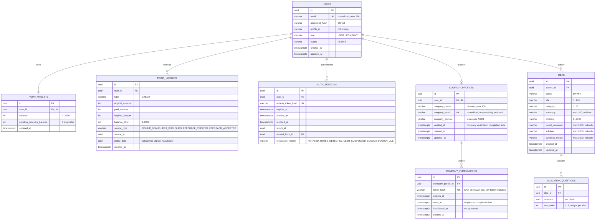

# SeedRank ERD

현재 구현된 데이터 모델을 수직 슬라이스 단위로 갱신한다.

## VS-001 제약

- `users.email`만 유일하며 공개 프로필 아이디는 중복을 허용한다.
- 사용자당 Point 지갑은 하나만 생성한다.
- 가입 시 User, PointWallet, PointLedger를 같은 트랜잭션에 저장한다.
- 가입 원장은 `300 = paidAmount(300) + expiredAmount(0)`을 만족한다.
- PointLedger는 append-only 데이터로 취급한다.
- `point_ledgers`의 UPDATE·DELETE는 데이터베이스 trigger가 거부하며 정정이 필요하면 새 원장 행을 추가한다.

## VS-031 제약

- 가입 보너스를 제외한 활동 보상은 Asia/Seoul 정책 날짜별 실제 지급 합계가 300P를 넘지 않는다.
- 지갑 잔액은 2,000P를 넘지 않으며 일일 한도나 지갑 상한 초과분은 원장에 `expired_amount`로 남기고 회수 대기 잔액으로 전환하지 않는다.
- 활동 보상은 `source_type`, `source_id` 조합당 한 번만 처리하며 사용자 지갑 행 잠금으로 같은 사용자의 동시 보상을 직렬화한다.
- 가입 보너스의 `policy_date`는 null이고 활동 보상은 Asia/Seoul 기준 날짜를 반드시 기록한다.
- 로그인 Refresh Token은 원문이 아닌 SHA-256 해시로만 AuthSession에 저장한다.
- Refresh Token은 family ID와 이전 세션 ID로 회전 계보를 보존하며 재사용 탐지 시 패밀리를 폐기한다.
- Access Token의 `sid` 클레임은 `auth_sessions.id`를 가리키며, 서명·만료와 해당 세션 활성 상태를 함께 검증한다.
- 현재 로그아웃은 세션 family를 `LOGOUT`으로, 전체 로그아웃은 사용자의 모든 활성 세션을 `LOGOUT_ALL`로 폐기한다.
- 로그인·갱신·로그아웃의 세션 변경은 사용자 행 잠금 후 수행해 동시 요청을 직렬화한다.

## VS-006 제약

- 사용자당 회사 프로필은 하나이며 정규화된 회사 이메일도 중복될 수 없다.
- 사용자 삭제 시 종속 회사 프로필도 함께 삭제된다.
- 회사 이메일 도메인은 소문자 ASCII로 정규화하고 무료 개인 메일 도메인 및 그 하위 도메인을 거부한다.
- 회사 이메일은 API 응답과 일반 로그에 노출하지 않는다.
- `verified_at`은 회사 인증 완료 전까지 null이며, 완료 시 인증 토큰의 `used_at`과 같은 시각으로 기록된다. 프로필이 존재하고 미인증이면 내 계정 상태는 `PENDING`, 인증 완료면 `VERIFIED`다.
- 인증 토큰과 메일 발송 데이터는 VS-007, 인증 완료와 Company 역할은 VS-008에서 추가한다.

## VS-007 제약

- 회사 인증 토큰은 URL-safe 256-bit 난수이며 원문은 메일 링크에만 전달하고 DB에는 SHA-256 해시만 저장한다.
- 인증은 기본 30분 뒤 만료되며 만료 시간은 애플리케이션 설정으로 변경할 수 있다.
- 회사 프로필별 미사용·미무효화 인증은 하나만 존재하며 재발송 시 기존 인증을 무효화한다.
- 메일은 요청 트랜잭션이 커밋된 뒤 별도 Executor에서 SMTP Provider로 발송한다.
- 회사 프로필 삭제 시 종속 인증 레코드도 함께 삭제된다.
- 유효한 인증 토큰은 행 잠금 뒤 한 번만 소비하며 `used_at`, `company_profiles.verified_at`, `users.role=COMPANY`를 한 트랜잭션에서 변경한다.

## VS-009 제약

- 로그인 사용자는 AI 없이 Idea를 `DRAFT` 상태로 생성한다.
- Draft 작성자는 내부 User UUID로 연결하며, 작성자만 Draft 상세를 조회한다.
- 제목·카테고리·문제는 필수이고 나머지 내용은 미완성 Draft를 위해 nullable이다.
- 게시 상태, 공개 범위, 최초 버전, 가격·보상과 AI Job 연결은 후속 슬라이스에서 추가한다.

## VS-013 제약

- 아이디어 작성자는 검증 질문 1~3개를 전체 교체 방식으로 저장한다.
- 요청 배열 순서를 아이디어별 고유한 `sort_order` 1~3으로 보존한다.
- 질문 문구는 앞뒤 공백을 제거하고 빈 값은 허용하지 않는다.
- 아이디어 삭제 시 해당 검증 질문도 함께 삭제한다.
