# SeedRank ERD

현재 구현된 데이터 모델을 수직 슬라이스 단위로 갱신한다.

```mermaid
erDiagram
    USERS ||--|| POINT_WALLETS : owns
    USERS ||--o{ POINT_LEDGERS : receives
    USERS ||--o{ AUTH_SESSIONS : authenticates
    USERS ||--o| COMPANY_PROFILES : registers
    COMPANY_PROFILES ||--o{ COMPANY_VERIFICATIONS : verifies
    USERS ||--o{ IDEAS : authors
    USERS ||--o{ FEEDBACKS : writes
    USERS ||--o{ SEED_UNIT_LOTS : purchases
    IDEAS ||--o{ SEED_UNIT_LOTS : holds
    SEED_UNIT_LOTS ||--o| SEED_UNIT_RECOVERIES : realizes
    USERS ||--o{ SEED_UNIT_RECOVERIES : receives
    IDEAS ||--o{ SEED_UNIT_RECOVERIES : prices
    USERS ||--o{ PENDING_RECOVERY_PAYOUTS : requests
    USERS ||--o{ AI_JOBS : requests
    AI_JOBS ||--o| AI_GENERATION_RESULTS : produces
    AI_JOBS ||--o| IDEAS : selected_into
    IDEAS ||--o{ VALIDATION_QUESTIONS : validates
    IDEAS ||--o{ IDEA_VERSIONS : snapshots
    IDEAS ||--o{ IDEA_TIMELINE_EVENTS : records
    IDEAS ||--o{ MESSAGE_THREADS : receives
    COMPANY_PROFILES ||--o{ MESSAGE_THREADS : starts
    USERS ||--o{ MESSAGE_THREADS : receives
    USERS ||--o{ IDEA_LIKES : likes
    IDEAS ||--o{ IDEA_LIKES : receives
    IDEAS ||--o{ FEEDBACKS : receives
    FEEDBACKS ||--o{ FEEDBACK_REVISIONS : snapshots
    FEEDBACKS ||--o| CONTRIBUTIONS : accepted_as
    USERS ||--o{ CONTRIBUTIONS : receives
    IDEAS ||--o{ CONTRIBUTIONS : recognizes
    IDEAS ||--o{ IDEA_VIEW_EVENTS : receives
    IDEAS ||--o| IDEA_METRIC_CURRENT : aggregates
    IDEAS ||--o{ IDEA_METRIC_HOURLY : buckets

    USERS {
        uuid id PK
        varchar email UK "normalized, max 254"
        varchar password_hash "BCrypt"
        varchar profile_id "not unique"
        varchar role "USER | COMPANY"
        varchar status "ACTIVE"
        timestamptz created_at
        timestamptz updated_at
    }

    POINT_WALLETS {
        uuid id PK
        uuid user_id FK,UK
        int balance "0..2000"
        int pending_recovery_balance "0 or greater"
        timestamptz updated_at
    }

    POINT_LEDGERS {
        uuid id PK
        uuid user_id FK
        varchar type "CREDIT | DEBIT"
        int original_amount
        int paid_amount
        int expired_amount
        int balance_after "0..2000"
        varchar source_type "includes UNIT_RECOVERY, PENDING_RECOVERY_PAYOUT"
        uuid source_id
        uuid reward_scope_id "nullable, idea scope for accepted feedback"
        date policy_date "nullable for signup, Asia/Seoul"
        timestamptz created_at
    }

    AUTH_SESSIONS {
        uuid id PK
        uuid user_id FK
        varchar refresh_token_hash UK
        timestamptz expires_at
        timestamptz created_at
        timestamptz revoked_at
        uuid family_id
        uuid rotated_from_id FK
        varchar revocation_reason "ROTATED, REUSE_DETECTED, USER_SUSPENDED, LOGOUT, LOGOUT_ALL"
    }

    COMPANY_PROFILES {
        uuid id PK
        uuid user_id FK,UK
        varchar company_name "trimmed, max 100"
        varchar company_email UK "normalized, response/log excluded"
        varchar company_domain "lowercase ASCII"
        timestamptz verified_at "company verification completion time"
        timestamptz created_at
        timestamptz updated_at
    }

    COMPANY_VERIFICATIONS {
        uuid id PK
        uuid company_profile_id FK
        varchar token_hash UK "SHA-256 lower hex, raw token excluded"
        timestamptz expires_at
        timestamptz used_at "single-use completion time"
        timestamptz invalidated_at "set by resend"
        timestamptz created_at
    }

    IDEAS {
        uuid id PK
        uuid author_id FK
        varchar status "DRAFT | PUBLISHED | ARCHIVED"
        varchar title "1..100"
        varchar category "1..50"
        varchar summary "max 200, nullable"
        varchar problem "1..2000"
        varchar target_customer "max 1000, nullable"
        varchar solution "max 2000, nullable"
        varchar business_model "max 2000, nullable"
        varchar visibility "PUBLIC | SEMI_PUBLIC | MATCHING, nullable for Draft"
        int current_unit_price "10P at publication, nullable for Draft"
        timestamptz published_at "nullable for Draft"
        uuid source_ai_job_id FK,UK "nullable, selected AI Job"
        int source_ai_candidate_number "nullable, 1..5"
        timestamptz created_at
        timestamptz updated_at
    }

    AI_JOBS {
        uuid id PK
        uuid owner_id FK
        varchar status "PENDING, PROCESSING, RETRY_WAIT, SUCCEEDED, FAILED"
        jsonb input_snapshot "keyword, background"
        varchar prompt_version
        varchar idempotency_key "unique per owner"
        int retry_count "0..3, final provider failure included"
        timestamptz locked_until "nullable"
        varchar lease_owner "nullable worker id"
        uuid lease_token "nullable fencing token"
        timestamptz next_attempt_at "nullable backoff"
        varchar failure_code "nullable, INVALID_RESPONSE_SCHEMA | AI_GENERATION_FAILED"
        timestamptz created_at
        timestamptz updated_at
    }

    AI_GENERATION_RESULTS {
        uuid id PK
        uuid ai_job_id FK,UK
        jsonb raw_result "provider structured output"
        jsonb normalized_result "problem analysis and 5 candidates"
        timestamptz created_at
    }

    VALIDATION_QUESTIONS {
        uuid id PK
        uuid idea_id FK
        text question "not blank"
        int sort_order "1..3, unique per idea"
    }

    IDEA_VERSIONS {
        uuid id PK
        uuid idea_id FK
        int version_number "unique per idea, append-only"
        varchar title
        varchar category
        varchar summary
        varchar problem
        varchar target_customer
        varchar solution
        varchar business_model
        varchar visibility
        text validation_questions "ordered immutable snapshot"
        uuid editor_id FK
        timestamptz created_at
    }

    IDEA_TIMELINE_EVENTS {
        uuid id PK
        uuid idea_id FK
        varchar event_type "PUBLISHED | UPDATED | FEEDBACK_ACCEPTED"
        uuid actor_id FK
        uuid source_id "nullable, accepted feedback"
        timestamptz created_at
    }

    MESSAGE_THREADS {
        uuid id PK
        uuid idea_id FK
        uuid company_profile_id FK
        uuid author_id FK
        timestamptz created_at
        timestamptz updated_at
    }

    FEEDBACKS {
        uuid id PK
        uuid idea_id FK
        uuid user_id FK
        varchar feedback_type "PROBLEM_EMPATHY | TARGET_CUSTOMER | SOLUTION | BUSINESS_MODEL | COMPETITION | OTHER"
        varchar content "normalized, 100..2000"
        varchar evidence_url "optional http/https"
        varchar evidence_description "optional, max 1000"
        timestamptz accepted_at "nullable until accepted"
        timestamptz edited_at "nullable until VS-026"
        timestamptz deleted_at "nullable until VS-026"
        timestamptz created_at
    }

    FEEDBACK_REVISIONS {
        uuid id PK
        uuid feedback_id FK
        varchar revision_type "EDITED | DELETED"
        varchar feedback_type "previous type"
        varchar content "previous normalized content"
        varchar evidence_url "previous optional URL"
        varchar evidence_description "previous optional description"
        timestamptz recorded_at "audit time"
    }

    CONTRIBUTIONS {
        uuid id PK
        uuid idea_id FK
        uuid user_id FK
        uuid source_feedback_id FK,UK
        timestamptz created_at
    }

    IDEA_VIEW_EVENTS {
        uuid id PK
        uuid idea_id FK
        uuid viewer_user_id FK "nullable for Guest"
        char guest_session_hash "nullable for User, SHA-256"
        char viewer_key_hash "dedupe key, SHA-256"
        timestamptz bucket_hour "UTC hour"
        timestamptz created_at
    }

    IDEA_METRIC_CURRENT {
        uuid idea_id PK,FK
        bigint view_count
        timestamptz updated_at
    }

    IDEA_METRIC_HOURLY {
        uuid idea_id PK,FK
        timestamptz bucket_hour PK "UTC hour"
        bigint view_delta
        timestamptz updated_at
    }

    SEED_UNIT_LOTS {
        uuid id PK
        uuid idea_id FK
        uuid user_id FK
        varchar purchase_request_key "user-scoped unique"
        int units "positive integer"
        int purchase_price "1..100 Point per Unit"
        int principal "units * purchase_price"
        timestamptz purchased_at
        timestamptz unlocked_at "purchased_at + 24 hours"
        varchar status "LOCKED | RECOVERED"
    }

    SEED_UNIT_RECOVERIES {
        uuid id PK
        uuid lot_id FK,UK
        uuid user_id FK
        uuid idea_id FK
        int units "whole recovered lot"
        int recovery_price "request-time price, 1..100"
        int realized_amount "units * recovery_price"
        int wallet_paid_amount "daily and wallet-cap limited"
        int pending_amount "fixed unpaid realization"
        timestamptz created_at
    }

    PENDING_RECOVERY_PAYOUTS {
        uuid id PK
        uuid user_id FK
        int paid_amount "positive"
        int balance_after "0..2000"
        date policy_date "Asia/Seoul"
        timestamptz paid_at
    }

    IDEA_LIKES {
        uuid id PK
        uuid idea_id FK
        uuid user_id FK
        timestamptz created_at
    }
```

## VS-001 제약

- `users.email`만 유일하며 공개 프로필 아이디는 중복을 허용한다.
- 사용자당 Point 지갑은 하나만 생성한다.
- 가입 시 User, PointWallet, PointLedger를 같은 트랜잭션에 저장한다.
- 가입 원장은 `300 = paidAmount(300) + expiredAmount(0)`을 만족한다.
- PointLedger는 append-only 데이터로 취급한다.
- `point_ledgers`의 UPDATE·DELETE는 데이터베이스 trigger가 거부하며 정정이 필요하면 새 원장 행을 추가한다.

## VS-031 제약

- 가입 보너스를 제외한 활동 보상은 Asia/Seoul 정책 날짜별 실제 지급 합계가 300P를 넘지 않는다.
- 지갑 잔액은 2,000P를 넘지 않으며 일일 한도나 지갑 상한 초과분은 원장에 `expired_amount`로 남기고 회수 대기 잔액으로 전환하지 않는다.
- 활동 보상은 `source_type`, `source_id` 조합당 한 번만 처리하며 사용자 지갑 행 잠금으로 같은 사용자의 동시 보상을 직렬화한다.
- 가입 보너스의 `policy_date`는 null이고 활동 보상은 Asia/Seoul 기준 날짜를 반드시 기록한다.

## VS-056 제약

- 활성 사용자의 성공한 로그인은 Asia/Seoul 정책 날짜별 첫 접속 1회에만 30P를 지급한다.
- 사용자 UUID와 정책 날짜로 만든 결정적 출처 UUID 및 `(source_type, source_id)` 유일 제약으로 연속·동시 로그인을 멱등 처리한다.
- 일일 첫 접속 보상은 하루 300P 활동 한도와 지갑 2,000P 상한을 적용하며 초과분을 원장에 소멸로 기록한다.
- 로그인 세션 생성과 첫 접속 Point 지급은 같은 트랜잭션에서 완료되거나 함께 롤백된다.
- 로그인 Refresh Token은 원문이 아닌 SHA-256 해시로만 AuthSession에 저장한다.
- Refresh Token은 family ID와 이전 세션 ID로 회전 계보를 보존하며 재사용 탐지 시 패밀리를 폐기한다.
- Access Token의 `sid` 클레임은 `auth_sessions.id`를 가리키며, 서명·만료와 해당 세션 활성 상태를 함께 검증한다.
- 현재 로그아웃은 세션 family를 `LOGOUT`으로, 전체 로그아웃은 사용자의 모든 활성 세션을 `LOGOUT_ALL`로 폐기한다.
- 로그인·갱신·로그아웃의 세션 변경은 사용자 행 잠금 후 수행해 동시 요청을 직렬화한다.

## VS-006 제약

- 사용자당 회사 프로필은 하나이며 정규화된 회사 이메일도 중복될 수 없다.
- 사용자 삭제 시 종속 회사 프로필도 함께 삭제된다.
- 회사 이메일 도메인은 소문자 ASCII로 정규화하고 무료 개인 메일 도메인 및 그 하위 도메인을 거부한다.
- 회사 이메일은 API 응답과 일반 로그에 노출하지 않는다.
- `verified_at`은 회사 인증 완료 전까지 null이며, 완료 시 인증 토큰의 `used_at`과 같은 시각으로 기록된다. 프로필이 존재하고 미인증이면 내 계정 상태는 `PENDING`, 인증 완료면 `VERIFIED`다.
- 인증 토큰과 메일 발송 데이터는 VS-007, 인증 완료와 Company 역할은 VS-008에서 추가한다.

## VS-007 제약

- 회사 인증 토큰은 URL-safe 256-bit 난수이며 원문은 메일 링크에만 전달하고 DB에는 SHA-256 해시만 저장한다.
- 인증은 기본 30분 뒤 만료되며 만료 시간은 애플리케이션 설정으로 변경할 수 있다.
- 회사 프로필별 미사용·미무효화 인증은 하나만 존재하며 재발송 시 기존 인증을 무효화한다.
- 메일은 요청 트랜잭션이 커밋된 뒤 별도 Executor에서 SMTP Provider로 발송한다.
- 회사 프로필 삭제 시 종속 인증 레코드도 함께 삭제된다.
- 유효한 인증 토큰은 행 잠금 뒤 한 번만 소비하며 `used_at`, `company_profiles.verified_at`, `users.role=COMPANY`를 한 트랜잭션에서 변경한다.

## VS-009 제약

- 로그인 사용자는 AI 없이 Idea를 `DRAFT` 상태로 생성한다.
- Draft 작성자는 내부 User UUID로 연결하며, 작성자만 Draft 상세를 조회한다.
- 제목·카테고리·문제는 필수이고 나머지 내용은 미완성 Draft를 위해 nullable이다.
- 게시 상태, 공개 범위, 최초 버전, 가격·보상과 AI Job 연결은 후속 슬라이스에서 추가한다.

## VS-018 제약

- 로그인 사용자의 사업화 키워드와 문제의식, 서버 Prompt Version을 생성 시점의 JSON 스냅샷으로 저장한다.
- Job은 `PENDING`, retry count 0으로 생성하며 Worker 선점과 상태 전이는 후속 슬라이스에서 구현한다.
- `(owner_id, idempotency_key)` 고유 제약으로 순차·동시 재전송을 한 Job으로 수렴시킨다.
- 같은 사용자의 같은 Key·같은 입력은 기존 Job을 반환하고, 다른 입력에 Key를 재사용하면 거부한다.

## VS-019 제약

- Worker는 실행 가능한 Job을 생성 시각 순으로 `FOR UPDATE SKIP LOCKED` 선점해 같은 Job의 중복 처리를 막는다.
- 선점 시 `PROCESSING` 상태, Worker ID, 매번 새로 발급한 fencing token과 2분 Lease를 저장한다.
- Lease가 만료된 Job은 새 token으로 재선점하며 이전 token은 상태를 변경할 수 없다.
- Timeout·429·5xx는 `RETRY_WAIT`로 전환하고 30초부터 최대 15분까지 지수 Backoff한 `next_attempt_at` 이후 다시 선점한다.

## VS-020 제약

- AI Provider 응답은 문제 분석과 제목·카테고리·요약·문제·고객·해결책·수익 모델을 모두 갖춘 후보 정확히 5개여야 한다.
- 후보 제목은 공백과 대소문자를 정규화한 기준으로 서로 달라야 하며 필드 길이는 Idea Draft 계약을 따른다.
- 유효한 원본·정규화 JSON은 Job당 하나의 `ai_generation_results`에 저장하고 Job을 `SUCCEEDED`로 종료한다.
- Schema 오류는 Timeout·429·5xx 재시도와 구분해 `FAILED / INVALID_RESPONSE_SCHEMA`로 기록한다.

## VS-022 제약

- 성공한 AI Job 소유자만 후보 번호 1~5와 편집 완료한 내용을 Idea Draft로 저장한다.
- Job당 AI 출처 Draft는 하나이며 Job 행 잠금과 `ideas.source_ai_job_id` 유일 제약으로 순차·동시 중복 선택을 막는다.
- AI 출처와 후보 번호는 내부에만 보존하고 응답에 Provider 원본·입력·Prompt·Lease 정보를 노출하지 않는다.
- 후보 선택은 Draft만 생성하며 게시·버전·타임라인·검증 질문·Point 원장을 생성하지 않는다.
- 원본 AI Job 삭제 시 해당 출처 Draft도 함께 제거해 출처가 끊긴 AI Draft가 남지 않게 한다.
- 성공·실패 완료는 활성 Lease fencing token으로 보호하고 결과만 저장하며 Idea를 자동 생성하거나 게시하지 않는다.

## VS-013 제약

- 아이디어 작성자는 검증 질문 1~3개를 전체 교체 방식으로 저장한다.
- 요청 배열 순서를 아이디어별 고유한 `sort_order` 1~3으로 보존한다.
- 질문 문구는 앞뒤 공백을 제거하고 빈 값은 허용하지 않는다.
- 아이디어 삭제 시 해당 검증 질문도 함께 삭제한다.

## VS-010 제약

- 완성된 Draft와 검증 질문 1~3개만 `PUBLIC`, `SEMI_PUBLIC`, `MATCHING` 중 하나로 게시할 수 있다.
- 게시 전환, 최초 전체 스냅샷 버전, 10P 현재 Unit 가격, 게시 타임라인과 해당 Point 보상은 하나의 트랜잭션이다.
- 아이디어 행을 잠가 중복·동시 게시에서도 최초 버전·타임라인·보상 출처가 한 번만 생성되게 한다.
- 공개형·반공개형 게시 보상은 50P이며 Asia/Seoul 하루 두 번까지 지급한다. 이후 게시 시도는 게시를 허용하되 전액 소멸 원장을 남긴다.
- 매칭형 게시에는 게시 보상을 지급하거나 원장을 생성하지 않는다.

## VS-047 제약

- 회사 이메일 인증을 완료한 `COMPANY`만 게시된 아이디어에 문의 스레드를 시작한다.
- `PUBLIC`, `SEMI_PUBLIC`, `MATCHING` 세 공개 범위에 동일한 문의 시작 권한을 적용한다.
- `(idea_id, company_profile_id, author_id)` 유일 제약과 회사 프로필 행 잠금으로 순차·동시 생성 요청을 멱등 처리한다.
- 스레드 생성 응답은 ID·아이디어 ID·생성 시각만 제공하며 회사 이메일이나 아이디어 상세를 노출하지 않는다.
- 메시지, 읽음 상태, 상세 열람 요청은 후속 슬라이스 범위다.

## VS-032 제약

- 게시된 다른 사용자의 아이디어만 구매할 수 있으며 양의 정수 Unit과 처리 시점 현재가를 사용한다.
- 확인 가격이 처리 시점 현재가와 다르면 구매하지 않고 가격 재확인을 요구한다.
- 구매 원금은 1회 100P, Asia/Seoul 하루 300P, 사용자별 아이디어 활성 원금 300P를 넘지 않는다.
- Point 지갑 잔액은 음수가 될 수 없고 Point 차감, `DEBIT/UNIT_PURCHASE` append-only 원장, `LOCKED` Lot을 하나의 트랜잭션으로 생성한다.
- Lot은 구매 시각, 구매 가격, Unit 수와 원금을 보존하며 잠금 해제 시각은 구매 후 정확히 24시간이다.
- 구매 요청은 사용자별 `purchase_request_key` 유일 제약으로 재전송을 멱등 처리하고, 사용자 지갑 행을 먼저 잠근 뒤 중복 키·잔액·일일·아이디어별 활성 원금 한도를 검사한다.
- 보유 조회와 회수는 VS-034~036에서 확장한다.

## VS-035 제약

- 소유자의 `LOCKED` Lot은 `unlocked_at` 이상인 시점에만 전체 Unit을 한 번 회수한다.
- 회수 실현액은 Lot 전체 Unit과 요청 시점의 아이디어 현재가로 고정하고 Lot 상태를 `RECOVERED`로 전환한다.
- Asia/Seoul 정책 날짜별 즉시 회수 지급 합계는 500P, 지갑 잔액은 2,000P를 넘지 않는다.
- 즉시 지급하지 못한 금액은 소멸하지 않고 `pending_recovery_balance`와 변경 불가능한 회수 기록에 보존한다.
- Lot 행과 사용자 지갑 행을 잠가 같은 Lot 재요청과 서로 다른 Lot의 동시 회수가 중복 지급되지 않게 한다.
- 즉시 지급분은 `CREDIT/UNIT_RECOVERY` append-only 원장으로 남기며 회수 기록은 Lot당 하나만 존재한다.

## VS-036 제약

- 사용자의 명시적 요청에만 이미 고정된 `pending_recovery_balance`를 지급하며 가격이나 실현액을 다시 계산하지 않는다.
- 사용자 지갑 행 잠금 안에서 대기 잔액, 지갑 2,000P 여유분, Asia/Seoul 정책 날짜별 남은 회수 지급 한도의 최솟값을 지급한다.
- 당일 `UNIT_RECOVERY` 즉시 지급액과 `PENDING_RECOVERY_PAYOUT` 수동 지급액의 합은 500P를 넘지 않는다.
- 실제 지급이 0이면 지급 기록과 원장을 만들지 않으며, 동시 요청도 대기 잔액보다 많이 지급할 수 없다.
- 실제 지급은 `pending_recovery_payouts`와 `CREDIT/PENDING_RECOVERY_PAYOUT` append-only 원장에 일대일로 기록한다.

## VS-011 조회 제약

- 공개형은 Guest를 포함한 모든 조회자에게 아이디어 전체 내용과 검증 질문을 반환한다.
- 반공개형 Guest에는 제목·카테고리·요약·문제 정의와 공통 게시 정보만 반환하며, 로그인 User·Company·작성자는 전체 내용을 조회한다.
- 매칭형은 Guest·User·Company에 요약과 공통 게시 정보만 반환하고 작성자에게만 전체 내용을 반환한다.
- 공개 범위상 숨겨진 필드는 `null` 값으로 직렬화하지 않고 JSON 응답 키 자체를 제외한다.
- Draft와 향후 비게시 상태는 작성자에게만 반환하며 다른 조회자에게는 존재 여부를 숨긴다.

## VS-012 제약

- 게시된 아이디어의 작성자만 제목·카테고리·요약·문제·대상 고객·해결책·수익 모델을 수정할 수 있다.
- 공개 범위·상태·가격·게시 시각은 내용 수정 API로 변경하지 않는다.
- 아이디어 행 잠금 뒤 최신 내용과 `updated_at`을 변경하고 다음 버전 번호의 전체 내용·현재 공개 범위·검증 질문·수정자·동일 시각 스냅샷을 한 트랜잭션으로 저장한다.
- `idea_versions`는 DB trigger가 UPDATE·DELETE를 거부하는 append-only 이력이다.
- 사용자 API에는 버전 목록·비교·복원 경로를 제공하지 않고 최신 내용과 `updatedAt`만 노출한다.

## VS-028 제약

- 활성 로그인 사용자는 세 공개 범위의 게시 아이디어에 좋아요를 등록·취소할 수 있다.
- `idea_likes`의 아이디어·사용자 조합은 유일하며 반복·동시 등록과 취소를 멱등하게 처리한다.
- 좋아요 변경은 아이디어 행 잠금 뒤 처리해 보관 전환과 경합해도 비게시 아이디어에 새 좋아요가 남지 않는다.
- 아이디어 상세는 기존 공개 범위 필드 정책을 유지하면서 현재 좋아요 수와 조회자의 좋아요 상태를 반환한다.

## VS-024 제약

- 활성 로그인 사용자는 `PUBLIC`, `SEMI_PUBLIC`, `MATCHING`으로 게시된 아이디어에 구조화 피드백을 등록할 수 있다.
- 피드백 유형과 앞뒤 공백 제거 후 100~2,000자 의견은 필수이며 HTTP(S) 근거 URL과 1,000자 이하 근거 설명은 선택이다.
- Feedback 생성과 `FEEDBACK_CREATED` 20P 활동 보상 원장을 하나의 트랜잭션으로 처리한다.
- Asia/Seoul 정책 날짜의 여섯 번째 피드백부터는 Feedback은 저장하되 일일 5회 제한으로 보상 전액을 소멸 기록한다.
- 공개 가능한 피드백 목록은 삭제 행을 제외하고 채택 우선·작성 시각·ID Cursor로 조회한다.
- 작성자만 피드백을 수정·soft delete하며 변경 전 전체 스냅샷과 감사 시각을 `feedback_revisions`에 보존한다.
- 채택·Contribution·기여 보상은 VS-027에서 확장한다.

## VS-027 제약

- 아이디어 작성자만 삭제되지 않은 미채택 피드백을 요청 본문 없이 한 번 채택할 수 있다.
- Feedback 채택 시각, 원본 피드백당 하나의 Contribution, `FEEDBACK_ACCEPTED` 타임라인과 100P 원장은 하나의 트랜잭션으로 처리한다.
- 동일 기여자·아이디어·Asia/Seoul 정책 날짜의 첫 채택만 100P를 지급하며 이후 채택은 Contribution과 타임라인을 남기되 100P 전액 소멸 원장을 기록한다.
- `point_ledgers.reward_scope_id`는 기여 보상의 아이디어 범위를 저장하며 지갑 행 잠금 안에서 범위별 지급 횟수를 검사한다.
- 반복·동시 채택은 피드백 행 잠금과 원본 피드백 유일 제약으로 Contribution·원장·타임라인 중복을 방지한다.
- 채택 취소, 채택 이유·수정 방향, AI 보강·자동 버전 연결은 MVP에서 제공하지 않는다.

## VS-029 제약

- 성공한 게시 아이디어 상세 조회만 집계하고 Draft·401·404 응답은 집계하지 않는다.
- 로그인 사용자는 사용자 ID, Guest는 원문을 저장하지 않는 서버 세션 ID 해시를 조회자 키로 사용한다.
- 같은 아이디어·조회자·UTC 시간 버킷의 이벤트는 unique 제약으로 한 번만 인정한다.
- 새 이벤트와 현재 누계·시간별 증가량은 하나의 트랜잭션에서 원자적으로 upsert한다.
- 상세 응답은 공개 범위와 무관한 공통 공개 지표 `viewCount`를 포함한다.
