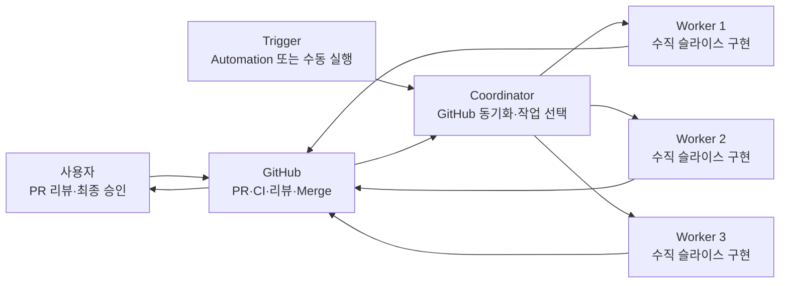
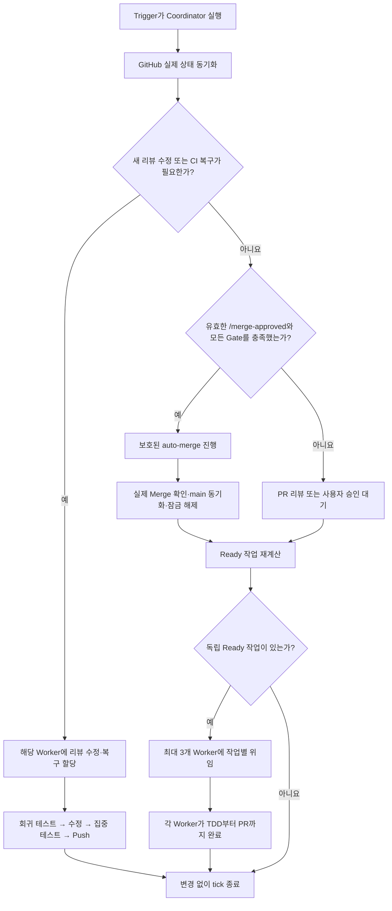
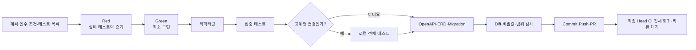
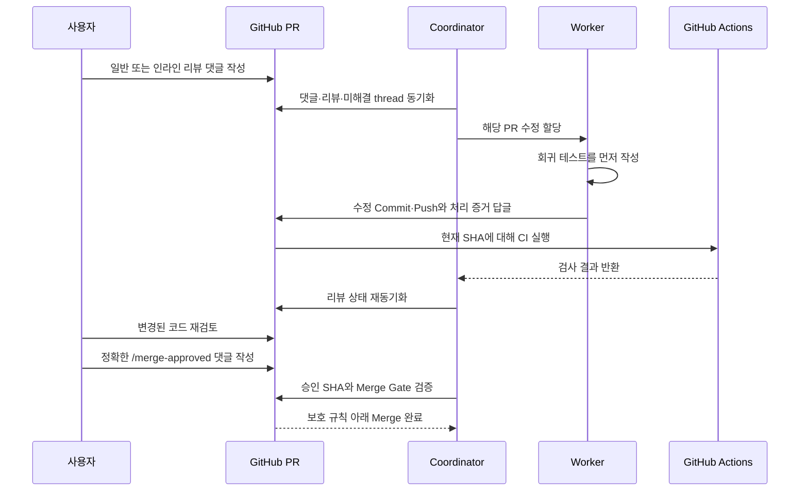
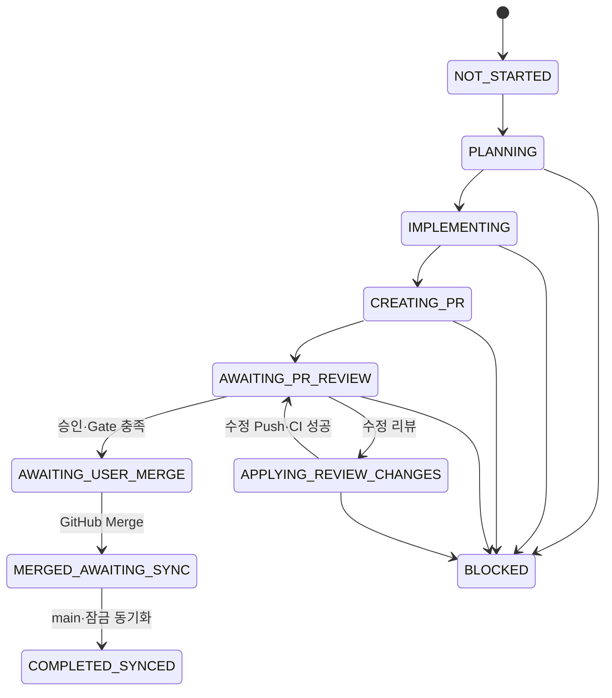
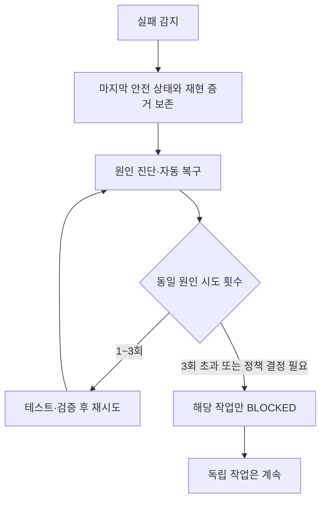

# OpenSeed 백엔드 수직 슬라이스 에이전트 운영 가이드

이 문서는 OpenSeed 백엔드의 백로그 구현, PR 리뷰 반영, 실패 복구와 후속 작업 선택을 담당하는 Codex 에이전트의 동작 방식을 설명한다. 팀원이 구현 순서와 안전장치를 이해하고 PR 리뷰에 참여할 수 있도록 작성한 공유용 자료다.

## 한눈에 보기

사용자는 생성된 PR을 리뷰하고 최종 병합 의사를 표시한다. 나머지 계획, 전체 TDD 구현, 문서 갱신, Git 작업, PR 생성, 리뷰 수정과 실패 복구는 에이전트가 수행한다.



핵심 원칙은 다음과 같다.

- 사용자 기능 하나를 API부터 DB와 문서까지 실제 동작하는 상태로 완성한다.
- 테스트를 먼저 실패시키고 최소 구현, 리팩터링, 집중 테스트 순서로 진행하며 최종 코드 SHA의 CI가 전체 회귀를 검증한다.
- GitHub의 실제 PR과 Merge 상태를 최종 기준으로 사용한다.
- 선행 PR이 실제 Merge되기 전에는 후속 작업을 시작하지 않는다.
- 서로 같은 영역을 수정하는 작업은 동시에 실행하지 않는다.
- 사용자가 현재 코드에 대해 정확한 `/merge-approved` 댓글을 남겨야 Merge가 진행된다.

## 현재 적용 상태

2026-07-21 기준으로 다음 구성이 `main`에 적용되어 있다.

| 구성 | 역할 | 위치 |
| --- | --- | --- |
| Coordinator Agent | 전체 실행 흐름 조정 | `.codex/agents/vertical-slice-coordinator.toml` |
| Worker Agent | 백로그 작업 하나 구현 | `.codex/agents/vertical-slice-worker.toml` |
| Agent 설정 | Coordinator가 Worker를 생성할 수 있는 깊이와 스레드 수 | `.codex/config.toml` |
| Vertical Slice Skill | 구현·리뷰·복구의 상세 절차 | `.agents/skills/vertical-slice/SKILL.md` |
| 저장소 규칙 | 개발·Git·보안 공통 규칙 | `AGENTS.md` |
| 백로그 | 작업 순서, 선행 조건, resource lock | `docs/workflow/backlog.yml` |
| 작업 상태 | 작업별 상태와 검증 증거 | `docs/workflow/slices/TASK-ID.yml` |
| GitHub Actions | 빌드·테스트, Merge Guard, 보호된 auto-merge | `.github/workflows/` |

에이전트 정의와 중첩 위임 설정이 적용되었으며, `openseed` Automation도 2026-07-21에 새 Coordinator 호출 방식으로 전환되었다. Automation은 5분마다 활성 thread를 깨우고 Coordinator에게 한 번의 orchestrator tick을 위임한다.

## 구성 요소별 책임

### Trigger

Trigger는 에이전트 실행을 시작하는 역할만 담당한다.

- 주기 실행: `openseed` Automation
- 수동 실행: 사용자가 Coordinator 실행을 요청
- 실행 주기와 활성 여부를 관리하지만 Ready 작업을 직접 판단하지 않는다.

### Coordinator Agent

Coordinator는 코드를 직접 대량 구현하는 대신 전체 상태를 조정한다.

1. 열린 작업 PR의 CI, 일반 댓글, 제출된 리뷰, 인라인 댓글과 미해결 thread를 동기화한다.
2. 새 작업보다 리뷰 수정과 실패 복구를 우선 처리한다.
3. `/merge-approved`의 작성자, 댓글 시각과 승인 대상 코드 SHA를 검증한다.
4. 실제 Merge를 확인하고 `main`, 선행 조건과 resource lock을 동기화한다.
5. 백로그에서 실행 가능한 독립 작업을 계산한다.
6. 선택한 작업마다 Worker 하나와 독립 worktree를 배정한다.
7. Worker가 반환한 테스트, 문서, 상태와 PR 증거를 검증한다.
8. 새 PR, 리뷰 반영, Merge, `BLOCKED`, 사용자 결정 필요가 있을 때만 보고한다.

CI·리뷰·승인·Merge는 GitHub에서 직접 읽는다. Coordinator는 이 관찰 결과만 기록하기 위한 상태 Commit을 만들지 않으며 CI 완료를 같은 tick에서 기다리지 않는다.

### Worker Agent

Worker는 할당된 백로그 작업 하나만 끝까지 처리한다.

- 최신 `origin/main`에서 독립 worktree와 브랜치를 사용한다.
- 기능 명세, 정책, 백로그와 과거 실패 교훈을 확인한다.
- 계획과 테스트 목록을 작성하되 사용자 중간 승인을 기다리지 않는다.
- 실패 테스트부터 작성하고 Red 증거를 기록한다.
- 최소 구현으로 테스트를 통과시킨 뒤 리팩터링한다.
- API 변경 시 OpenAPI, DB 변경 시 새 Flyway Migration과 ERD를 갱신한다.
- 집중 테스트와 상태 검증 뒤 Draft PR을 만들고 PR 정보를 포함한 최종 상태를 한 번 Push한다.
- 일반 기능은 최종 Head의 GitHub CI로 전체 회귀를 검증하고, 고위험 변경만 로컬 전체 테스트를 추가한다.
- 리뷰 지적은 회귀 테스트를 먼저 추가한 뒤 같은 PR에 반영한다.

### Skill과 저장소 규칙

Custom Agent에는 역할과 핵심 안전장치만 둔다. 상세 절차는 `$vertical-slice` Skill에 한 번만 유지하고, 저장소 전체에 공통인 개발·보안·Git 규칙은 `AGENTS.md`에서 관리한다. 이렇게 해야 서로 다른 문서에 같은 규칙이 복제되어 불일치하는 것을 막을 수 있다.

## 전체 실행 흐름

Coordinator가 한 번 실행되는 단위를 `tick`이라고 한다.



처리 우선순위는 항상 다음과 같다.

```text
리뷰 수정·실패 복구
→ 병합 승인과 Gate 확인
→ 실제 Merge 동기화
→ 새 Ready 작업 선택
```

## Worker의 전체 TDD 흐름



Red·Green·리팩터링 중에는 관련 테스트만 실행한다. 다음 고위험 변경에는 로컬 전체 검증도 한 번 실행한다.

- Migration과 DB 제약
- 인증·인가와 공개 범위
- Point·Unit 정합성과 동시성
- 공통 오류·설정·Gradle 변경

```bash
./gradlew test
```

일반 기능 변경은 최종 Head의 GitHub `Build and Test`를 전체 회귀 검증으로 사용한다. 문서·상태·워크플로우만 바뀐 Push는 Java 테스트 대신 아래 검증만 실행한다.

워크플로우 파일도 함께 검증한다.

```bash
ruby .agents/skills/vertical-slice/scripts/validate_backlog.rb docs/workflow/backlog.yml
ruby .agents/skills/vertical-slice/scripts/validate_state.rb docs/workflow/slices/TASK-ID.yml
ruby .agents/skills/vertical-slice/scripts/validate_backlog_test.rb
ruby .agents/skills/vertical-slice/scripts/check_merge_guard_test.rb
ruby .agents/skills/vertical-slice/scripts/select_backend_test_scope_test.rb
```

## 병렬 실행과 resource lock

병렬 처리에는 세 가지 제한이 함께 적용된다.

1. `.codex/config.toml`의 `max_depth = 2`
   - Trigger의 실행 컨텍스트 → Coordinator → Worker 구조를 허용한다.
2. `.codex/config.toml`의 `max_threads = 6`
   - Coordinator와 최대 3개 Worker, 상태 처리에 필요한 실행 여유를 제공한다.
3. `backlog.yml`의 `max_parallel_workers = 3`
   - 실제 구현·리뷰 수정·복구 Worker를 동시에 최대 3개까지만 실행한다.

`AWAITING_PR_REVIEW` 또는 `AWAITING_USER_MERGE` 상태의 PR은 Worker 실행 슬롯을 차지하지 않는다. 하지만 실제 Merge 전까지 작업 ID와 resource lock은 계속 예약한다.

예를 들어 다음 두 작업은 동시에 실행할 수 없다.

```yaml
- id: VS-009
  resource_locks: [idea]

- id: VS-010
  resource_locks: [idea, wallet]
```

VS-009의 PR이 리뷰 대기 중이어도 `idea` 잠금은 유지된다. 따라서 VS-010은 VS-009가 실제 Merge되고 잠금이 해제된 다음 시작한다.

반대로 `company`, `idea`, `ops`처럼 잠금이 겹치지 않고 모든 선행 작업이 Merge된 작업은 서로 다른 worktree에서 병렬로 실행할 수 있다.

## PR 리뷰와 비동기 수정

사용자는 여러 PR을 순서대로 리뷰할 수 있고, 에이전트는 각 PR의 리뷰를 비동기로 처리한다.



실행 가능한 리뷰는 자동 반영한다. 다음 경우에는 해당 PR만 `BLOCKED`로 두고 사용자 결정을 요청한다.

- 리뷰 내용이 모호하거나 서로 충돌한다.
- 현재 백로그 범위를 넘는 제품 기능을 요구한다.
- 기존 기획이나 정책을 변경해야 한다.
- 새로운 외부 권한이나 파괴적 작업 권한이 필요하다.

## `/merge-approved` 규칙

`/merge-approved`는 단순한 텍스트가 아니라 현재 코드에 대한 최종 병합 승인 증거다.

다음 조건을 모두 만족해야 유효하다.

- `backlog.yml`에 설정된 승인자가 작성했다.
- 댓글 본문이 정확히 `/merge-approved`다.
- 현재 코드 SHA가 만들어진 이후에 작성되었다.
- 현재 SHA의 필수 CI가 성공했다.
- 미해결 review thread가 없다.
- 선행 작업이 실제 Merge되었다.
- PR에 충돌이 없다.
- 활성 실패가 없다.

승인 후 코드가 Push되면 기존 auto-merge가 자동 해제된다. 사용자는 변경된 코드를 다시 확인하고 새로운 `/merge-approved` 댓글을 남겨야 한다.

에이전트는 관리자 우회나 강제 Merge를 사용하지 않는다. GitHub Branch Protection과 Vertical Slice Merge Guard가 최종 권한을 가진다.

## 작업 상태 모델

작업 상태는 `docs/workflow/slices/TASK-ID.yml`에 schema version 2로 기록한다.



각 전이는 시각, 이전 상태, 다음 상태, 명령과 설명을 history에 추가한다. 기존 history는 수정하지 않는다. 다만 새 PR의 committed state는 일반적으로 `AWAITING_PR_REVIEW`에 머물고, 이후 CI·리뷰·승인·Merge 상태는 GitHub에서 직접 판정한다.

상태 파일에는 전체 로그나 비밀값 대신 다음과 같은 최소 재현 증거만 저장한다.

- 선행 PR과 Merge commit
- Red, 집중 테스트와 필요한 로컬 전체 테스트의 명령·결론·시각
- PR 번호와 URL
- 리뷰 댓글 ID와 처리 결과

`/merge-approved`, 현재 Head SHA, CI, 미해결 thread와 Merge commit은 런타임에 GitHub에서 읽으며 이를 기록하기 위한 별도 Push를 하지 않는다. 실제 Merge가 확인되면 `COMPLETED_SYNCED` 전용 PR 없이 즉시 잠금과 후속 의존성을 해제한다.

## 실패 복구와 반복 방지

실패는 현재 작업만 멈추고 다른 독립 작업까지 중단시키지 않는다.



실패 기록은 두 종류로 나눈다.

| 종류 | 기록 위치 | 예시 |
| --- | --- | --- |
| Workflow Failure | `docs/workflow/lessons/workflow-failures.yml` | 상태 전이, Git 동기화, CI·도구 호출 순서, 환경 문제 |
| Implementation Lesson | `docs/workflow/lessons/implementation-lessons.yml` | 비즈니스 규칙, 테스트, API, Migration, 보안, 리뷰 지적 |

같은 원인은 `fingerprint`로 묶고 `recurrence_count`를 증가시킨다.

- 2회 이상 반복: 회귀 테스트나 자동 검증 규칙을 제안한다.
- 3회 이상 반복: 안전한 범위에서 테스트, 스크립트, `AGENTS.md`, Skill 또는 CI에 방지책을 반영한다.
- 제품 정책이나 권한 변경이 필요하면 자동으로 결정하지 않고 해당 PR만 차단한다.

## 사용자가 하는 일

사용자 역할은 세 가지다.

1. 생성된 PR을 원하는 순서로 리뷰한다.
2. 수정이 필요하면 일반 댓글, 리뷰 또는 인라인 댓글을 남긴다.
3. 현재 코드로 병합해도 되면 PR 일반 댓글에 정확히 `/merge-approved`를 남긴다.

사용자는 다음 중간 승인을 반복하지 않는다.

- 기능·테스트 목록 승인
- 실패 테스트 작성 승인
- 최소 구현 승인
- 리팩터링 승인
- 리뷰 수정 계획 승인
- Commit·Push·PR 생성 승인

모호한 정책 결정, 범위 확대, 새로운 권한 또는 파괴적 작업이 필요한 경우에만 에이전트가 사용자에게 질문한다.

## 에이전트가 하지 않는 일

- `main`에 직접 Push하지 않는다.
- 강제 Push하지 않는다.
- 관리자 권한으로 Branch Protection을 우회하지 않는다.
- 선행 PR이 Merge되기 전에 후속 기능을 시작하지 않는다.
- 같은 resource lock을 가진 작업을 동시에 수정하지 않는다.
- 이미 적용된 Flyway Migration을 수정하지 않는다.
- 비밀번호, 토큰, API 키, 인증서 또는 개인정보를 기록하지 않는다.
- 미해결 리뷰를 무시하고 `/merge-approved`만으로 Merge하지 않는다.

## 운영자가 확인할 수 있는 결과

정상적인 작업 PR에는 다음 정보가 포함된다.

- 구현한 사용자 결과
- 인수 조건과 제외 범위
- Red, Green, 집중 테스트와 전체 테스트 증거
- API 및 DB 변경
- OpenAPI, ERD와 Migration 변경 여부
- 선행 작업 Merge 증거
- 알려진 제한
- 자동 리뷰 반영 정책

Coordinator는 변화가 없을 때 파일을 수정하지 않는다. 새 PR, 리뷰 반영, Merge, `BLOCKED` 또는 사용자 결정 필요가 있을 때만 간결한 알림을 남긴다.

## 현재 Automation 호출 구조

현재 실제 호출 구조는 다음과 같다.

```text
openseed Automation
└── vertical-slice-coordinator
    ├── vertical-slice-worker: 작업 또는 리뷰 수정 A
    ├── vertical-slice-worker: 작업 또는 리뷰 수정 B
    └── vertical-slice-worker: 작업 또는 리뷰 수정 C
```

Automation은 Coordinator를 깨우는 역할만 맡고, 구체적인 판단은 Agent → Skill → 백로그·상태·GitHub 순서로 수행한다. Hook은 현재 구성에 포함되지 않으며 에이전트 실행에 필수도 아니다. 반복적으로 발생하는 위험 행동이 확인될 때만 명령 전후의 추가 강제 장치로 검토한다.

## 관련 문서

- `AGENTS.md`
- `.codex/agents/vertical-slice-coordinator.toml`
- `.codex/agents/vertical-slice-worker.toml`
- `.agents/skills/vertical-slice/SKILL.md`
- `.agents/skills/vertical-slice/references/autonomous-policy.md`
- `.agents/skills/vertical-slice/references/state-schema.md`
- `.agents/skills/vertical-slice/references/failure-policy.md`
- `docs/workflow/backlog.yml`
- `docs/workflow/AUTONOMOUS_WORKFLOW.md`
