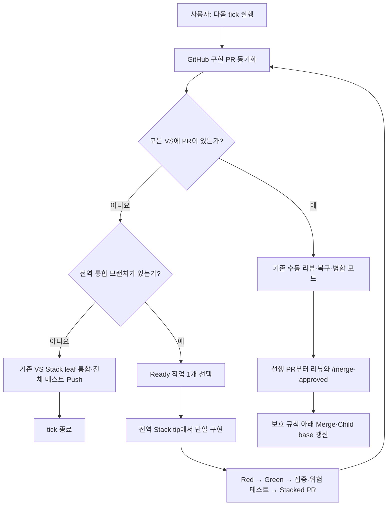

# 자동 수직 슬라이스 워크플로우

현재는 모든 VS 구현 PR을 먼저 준비하는 임시 Fast Build 모드다. 사용자는 Build 단계가
끝난 뒤 PR을 stack 선행 순서대로 리뷰하고 병합을 승인한다. 모든 VS 작업에 구현 PR이
생기면 같은 수동 tick이 자동으로 기존 리뷰·복구·병합 흐름으로 돌아온다.



## 사용자가 하는 일

1. Fast Build 동안에는 `/merge-approved`를 남기지 않고 PR 생성을 기다린다.
2. Build 종료 안내 후 stack 선행 순서로 PR을 리뷰한다.
3. 수정이 필요하면 일반 리뷰 댓글이나 인라인 댓글을 남긴다.
4. 현재 코드로 병합해도 되면 PR 일반 댓글에 정확히 `/merge-approved`를 남긴다.

코드 변경 Push가 발생하면 이전 병합 승인은 낡은 것으로 처리한다. 변경된 코드를 다시 확인한 뒤 새 `/merge-approved` 댓글을 남긴다.

## 자동 처리 순서

1. Build 단계에서는 Merge되었거나 열린 구현 PR이 있는 VS 작업을 계산한다.
2. Ready 작업을 순서대로 하나만 고른다.
3. 첫 tick은 기존 열린 VS Stack leaf들을 `codex/vs-fast-build-trunk`에 통합하고 종료한다.
4. 첫 신규 VS는 통합 브랜치, 이후 VS는 직전 전역 PR branch를 base로 만든다.
5. PR을 만든 즉시 tick을 종료하고 다음 작업은 다음 수동 tick에서 선택한다.
6. 리뷰는 `리뷰 tick 실행`에서만 우선 처리한다.
7. 모든 VS에 PR이 생기면 기존 수동 리뷰·복구·병합 순서로 자동 전환한다.

## 안전 장치

- 전역 통합 브랜치는 기존 Stack leaf의 기능을 모두 보존하고 전체 테스트를 통과해야 한다.
- 새 VS PR은 모두 하나의 `VS-GLOBAL` Stack에 일렬로 연결한다.
- 서로 다른 기존 Stack의 fan-in은 통합 브랜치 위에서만 구현한다.
- Stack 깊이 4마다 전체 테스트를 실행하지만 중간 병합은 요구하지 않는다.
- 동일 실패는 최대 3회 복구하고, 이후 해당 PR만 차단한다.
- `/merge-approved`, 해결된 리뷰 대화, 성공한 필수 검사, 충돌 없음이 모두 충족돼야 Merge된다.
- 관리자 우회, 강제 Push, `main` 직접 Push는 허용하지 않는다.
- GitHub PR 상태가 실행 중 상태의 최종 기준이다.

## 상태 확인

Ready 작업을 로컬에서 확인하려면 다음 명령을 사용한다. 자동 실행기는 GitHub에서 얻은 Merge 및 활성 작업 JSON을 함께 전달한다.

```bash
ruby .agents/skills/vertical-slice/scripts/select_ready_tasks.rb \
  docs/workflow/backlog.yml \
  --merged '["VS-006"]' \
  --active '[]' \
  --open '[{"id":"VS-009","resource_locks":["idea"],"head_ref":"codex/vs-009-draft","pr_number":29,"stack_depth":1}]'
```

백로그와 규칙 자체는 다음 명령으로 검증한다.

```bash
ruby .agents/skills/vertical-slice/scripts/validate_backlog.rb docs/workflow/backlog.yml
ruby .agents/skills/vertical-slice/scripts/validate_backlog_test.rb
ruby .agents/skills/vertical-slice/scripts/check_merge_guard_test.rb
```
