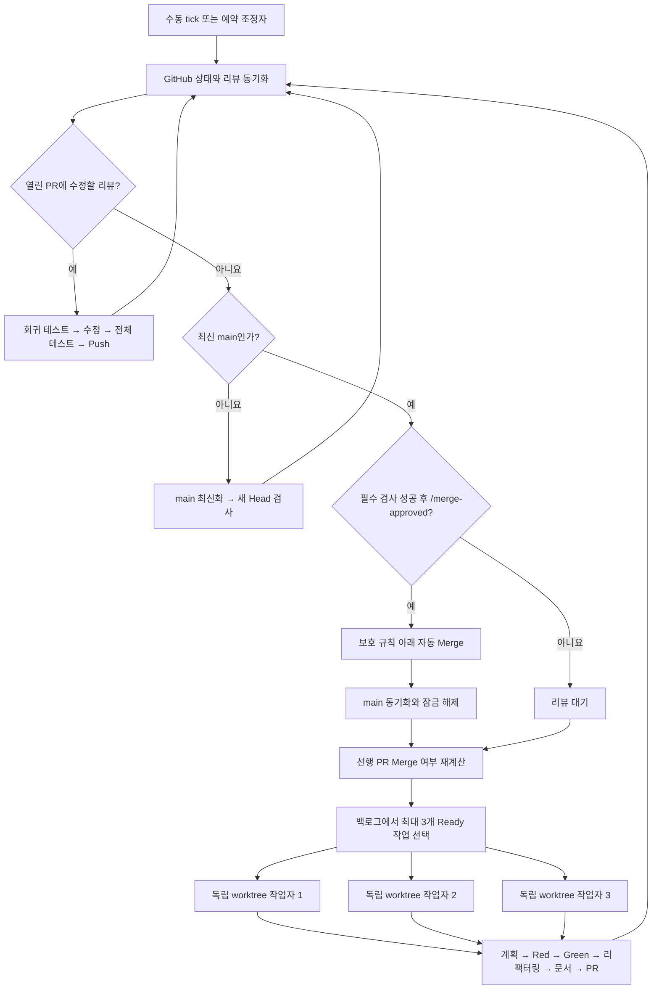

# 자동 수직 슬라이스 워크플로우

사용자는 PR을 리뷰하고 병합을 승인한다. 계획, TDD 구현, 문서, Git, PR 생성, 리뷰 수정, CI 복구와 다음 작업 선택은 Codex가 자동 처리한다.



## 사용자가 하는 일

1. 생성된 PR을 원하는 순서로 리뷰한다.
2. 수정이 필요하면 일반 리뷰 댓글이나 인라인 댓글을 남긴다.
3. PR이 최신 main이고 현재 Head의 필수 검사가 성공한 뒤, 병합해도 되면 일반 댓글에 정확히 `/merge-approved`를 남긴다.

코드 변경 Push가 발생하면 이전 병합 승인은 낡은 것으로 처리한다. 변경된 코드를 다시 확인한 뒤 새 `/merge-approved` 댓글을 남긴다.

## 자동 처리 순서

1. 열린 PR의 새 댓글과 미해결 대화를 먼저 처리한다.
2. 실행 가능한 리뷰는 테스트를 먼저 추가하고 수정한 뒤 같은 PR에 Push한다.
3. 모호한 리뷰나 제품 정책 결정은 그 PR만 `BLOCKED`로 두고 다른 PR은 계속 처리한다.
4. 리뷰 준비 PR을 최신 main으로 갱신하고 새 Head의 필수 검사를 실행한다.
5. 검사 성공 뒤 작성된 `/merge-approved`만 받아 보호된 Merge를 진행한다.
6. Merge된 PR을 확인해 의존성과 잠금을 갱신한다.
7. `docs/workflow/backlog.yml`에서 Ready 작업을 순서대로 최대 3개 고른다.
8. 각각 독립 worktree에서 전체 수직 슬라이스를 구현해 PR을 만든다.

## 안전 장치

- 선행 PR이 GitHub에서 실제 Merge되기 전에는 후속 브랜치를 만들지 않는다.
- 같은 resource lock을 가진 작업은 동시에 실행하지 않는다.
- 동일 실패는 최대 3회 복구하고, 이후 해당 PR만 차단한다.
- 최신 main, 성공한 필수 검사, 그 이후의 `/merge-approved`, 해결된 리뷰 대화와 충돌 없음이 모두 충족돼야 Merge된다.
- 관리자 우회, 강제 Push, `main` 직접 Push는 허용하지 않는다.
- GitHub PR 상태가 실행 중 상태의 최종 기준이다.

## 상태 확인

Ready 작업을 로컬에서 확인하려면 다음 명령을 사용한다. 자동 실행기는 GitHub에서 얻은 Merge 및 활성 작업 JSON을 함께 전달한다.

```bash
ruby .agents/skills/vertical-slice/scripts/select_ready_tasks.rb \
  docs/workflow/backlog.yml \
  --merged '["VS-006"]' \
  --active '[{"id":"VS-009","resource_locks":["idea"]}]'
```

백로그와 규칙 자체는 다음 명령으로 검증한다.

```bash
ruby .agents/skills/vertical-slice/scripts/validate_backlog.rb docs/workflow/backlog.yml
ruby .agents/skills/vertical-slice/scripts/validate_backlog_test.rb
ruby .agents/skills/vertical-slice/scripts/check_merge_guard_test.rb
ruby .agents/skills/vertical-slice/scripts/check_merge_approval_gate_test.rb
```
